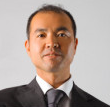

   **Paulo** the product owner suggests the team work with **Chun** the DevOps coach to initiate and run a Kaizen process.  

   **Brenda** from the business is already seeing the potential of the VSM is intrigued and wants to hear more.  

  **Chun** explains that Kaizen is a Japanese word that translates to **"change for better"**, and that Kaizen involves a process of continuous improvement undertaken by teams (which can cross organizational boundaries when necessary). Kaizen aims to improve customer/client outcomes by eliminating waste and making organizations leaner by incrementally improving and standardizing processes along the entire value stream.  

---

|   |   |   |  
|---|---|---|  
| || |  

**Dan** the developer thinks that Kaizen has similar objectives to DevOps, a point **Adam** agrees with.  
**Chun** confirms that understanding and explains that **DevOps Kaizen** is a process which uses DevOps tools, technologies, and methodologies to continuously improve the flow of work through the E2E value stream to achieve better customer outcomes.  

The team is excited by what **Paulo** and **Chun** are proposing.  

---

  **Tina** the tester has been striving to introduce Test Driven Development (TDD) and sees how that now aligns with [the 3 ways of DevOps](https://itrevolution.com/the-three-ways-principles-underpinning-devops/).  

  **Selma** also agrees as she sees the 3 ways of DevOps supporting the "Shift Left on Security" (preventing issues rather than detecting and fixing them), which she has been championing for some time.  

  **Santhosh** the Scrum master suggests that those (and any other ideas resulting from an analysis of the VSM) will act as inputs into the Kaizen events to be scheduled as part of a structured approach to solving the teams problems. The aim of the Kaizen events is to have the team focus on improving flow and processes incrementally.  

  **Paulo** explains that for Kaizen to work, everyone on the team needs to approach it with an open mindset - to focus on looking for ideas which hopefully can be implemented easily and quickly so that Kaizen becomes embedded into the culture of the Pet Clinic team.  

---

  **Chun** reminds people of [the 3 ways of DevOps](https://itrevolution.com/the-three-ways-principles-underpinning-devops/):  

- **The First Way** emphasizes the performance of the entire system, as opposed to the performance of a specific silo of work or department.  
- **The Second Way** is about creating the right to left feedback loops. The goal of almost any process improvement initiative is to shorten and amplify feedback loops so necessary corrections can be continually made.  
- **The Third Way** is about creating a culture that fosters two things:  
  - continual experimentation - taking risks and learning from failure  
  - understanding that repetition and practice is the prerequisite to mastery  

She shares the following with the team according to the [Kaizen Institute](https://us.kaizen.com/)

Kaizen is composed of seven core principles:  

- Good processes bring good results.  
- Go see for yourself to grasp the current situation.  
- Speak with data, manage by facts.  
- Take action to contain and correct root causes of problems.  
- Work as a team.  
- Kaizen is everybody’s business.  
- Make small changes over time.  

This is **DevOps Kaizen**  
